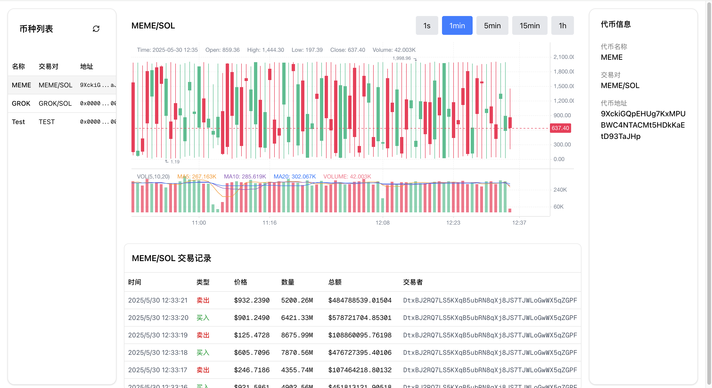

# Crypto Exchange Dashboard

A real-time cryptocurrency trading dashboard built with Next.js, featuring live K-line charts and transaction data.


## Features

-   Real-time K-line chart visualization
-   Multiple time period support (1s, 1min, 5min, 15min, 1h)
-   Live transaction records
-   Asset list with detailed information
-   Responsive grid layout

## Screenshots

### K-line Chart




## Local Development

```bash
# Install dependencies
yarn install

# Start development server
yarn dev
```

## Docker Deployment

### Build Image

```bash
# Build Docker image
docker build -t kline-app .
```

### Run Container

```bash
# Run container
docker run -d -p 3000:3000 --name kline-app kline-app

# View logs
docker logs -f kline-app

# Stop container
docker stop kline-app

# Remove container
docker rm kline-app
```

### Environment Variables

The application uses the following environment variables:

-   `NEXT_PUBLIC_API_URL`: API endpoint URL (default: http://127.0.0.1:80)

For local development, create a `.env.local` file:

```bash
NEXT_PUBLIC_API_URL=http://127.0.0.1:80
```

## Tech Stack

-   Next.js - React framework
-   React - UI library
-   TypeScript - Type safety
-   TailwindCSS - Styling
-   KLineChart - Chart visualization
-   Shadcn/UI - UI library
-   SSE - Server-Sent Events
